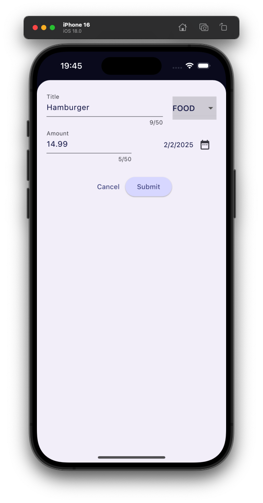

<p align="center">
    
    
    
    
</p>

# Expense Tracker

This project is a Flutter-based mobile application designed to help users track their expenses. The app allows users to add, edit, and delete expense entries, categorize expenses, and view detailed reports and charts to analyze their spending habits. The goal of this project is to provide an intuitive and user-friendly interface for managing personal finances.

## Features

- Add, edit, and delete expense entries
- Categorize expenses
- View detailed reports and charts
- User-friendly interface
- Cross-platform support (iOS and Android)
- Dark and light mode support for better user experience


## Installation

To run this project, ensure you have Flutter installed on your machine. Then, follow these steps:

1. Clone the repository:
    ```sh
    git clone https://github.com/yourusername/expense_tracker.git
    ```
2. Navigate to the project directory:
    ```sh
    cd expense_tracker
    ```
3. Install dependencies:
    ```sh
    flutter pub get
    ```
4. Run the app:
    ```sh
    flutter run
    ```

## Contributing

Contributions are welcome! Please fork the repository and submit a pull request with your changes.

